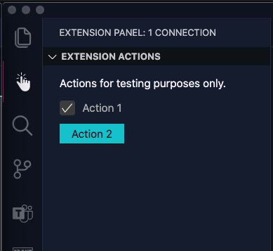

# VSCode Extensions Panel

An extension that provides an activity panel that other extensions can use to add their actions. When you want to visualize your command or extension actions, this extension provides a quick and easy way to do this. Instead of writing your view panel, you register your extension for panel usage with the required configuration.



## Usage

### Extension dependency

First, you can take a dependency on this extension. It isn't a requirement, but when you do, you make sure this extension will get installed when your extension gets installed.

In your `package.json` add the following content:

```json
{
  ...
  "extensionDependencies": [
    "eliostruyf.vscode-extension-panel"
  ],
}
```

> *Info*: You can continue without this configuration. When the user doesn't have this extension installed, it will simply skip the visualization of your actions in a view panel.

### Register your actions

The extension panel will look for a specific command in your extension and executes it. To define your actions, you will need to create the following command registration in your extension's code:

```typescript
context.subscriptions.push(vscode.commands.registerCommand('<publisher>.<your-extension-name>.panel.registration', () => {
		return {
			id: '<your-extension-name>',
			title: 'Extension actions',
			description: 'Actions for testing purposes only.',
			actions: [{
				title: 'Action 1',
				command: 'vscode-extension-panel.panel.test',
				data: true,
				type: "checkbox"
			}, {
				title: 'Action 2',
				command: 'vscode-extension-panel.panel.test',
				data: 'Just extra text',
				type: "button"
			}]
		};
	})
);
```

**Important**: Update the `<publisher>` and `<your-extension-name>` values with the publisher and extension name of your extension.

> *Info*: Whenever a file gets opened, the panel will call this command and allows you to dynamically define which actions you want to show per file, type, ...

